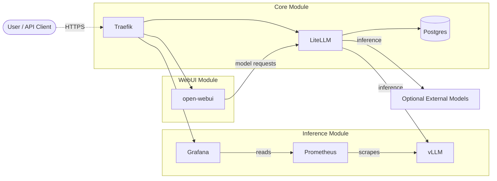

# LLM Environment Stack
A modular stack for local LLM inference with a web-based front-end and
telemetry/logging.

### Description
The stack is built around a modular set of services that together provide a
full‑featured, production‑ready platform for interacting with large language
models (LLMs) in internet-facing or air-gapped networks via API or a web
interface.

This stack was designed with modularity in mind, allowing for easy
addition/subtraction of services. With the base configuration, the environment
allows one to easily deploy means of hosting, chatting with, monitoring
performance of, and auditing user interaction with LLMs.

Additionally, as long as the certs given to Traefik and the DNS entries are set
up correctly, new web services should be easily addable by simply adding a new
subdomain using Traefik labels in that service's Docker Compose labels. This
simple pattern removes the need for editing DNS entries and network
certificates each time a new service is added.


### Terms
- **Core Module**: Services that provide shared infrastructure to all other modules (routing, TLS, storage).
- **Modules**: Self-contained sets of services that can be enabled or disabled independently (`core`, `inference`, `webui`).


### Core Data Flow
1. **Users** (human or programmatic) send queries either through the **Open‑WebUI** interface or directly via the **LiteLLM** API gateway.
2. **LiteLLM** acts as a routing layer: it forwards each request to the appropriate **vLLM** inference service and applies policies such as rate‑limiting, cost tracking, and model fallback.
3. **vLLM** hosts the actual LLM(s), providing an OpenAI‑compatible API and exposing Prometheus metrics for performance monitoring.
4. **Prometheus** scrapes real‑time metrics from vLLM; **Grafana** visualises them for operational insight.

> **Optional:** When Langfuse credentials are configured, LiteLLM and Open‑WebUI will forward prompt/response data to your Langfuse instance for tracing and auditing. Langfuse is an external service and is not deployed as part of this stack.

### Service Roles

| Service | Module | Primary Role | Key Functions |
|---------|--------|--------------|---------------|
| **Open‑WebUI** | `webui` | User‑facing web interface | Chat UI, SSO, RAG (vector store + embeddings), multimodal I/O (images, TTS/STT), in‑browser Python, MCP tool calling |
| **LiteLLM** | `core` | Routing gateway | Consolidates calls to multiple back‑ends, cost/budget tracking, load‑balancing, OpenAI‑compatible endpoint |
| **vLLM** | `inference` | Inference engine | Multi‑GPU/node scaling, dynamic batching, OpenAI API compatibility, exposes Prometheus metrics |
| **Postgres** | `core` | Relational store | Persists LiteLLM routing state and Open‑WebUI data |
| **Prometheus** | `inference` | Metrics collection | Scrapes vLLM metrics at 5s intervals |
| **Grafana** | `inference` | Metrics visualisation | Dashboards for token throughput, latency percentiles, cache hit rates |
| **Traefik** | `core` | Reverse proxy / TLS | SSL termination, HTTP→HTTPS redirect, routes traffic to all services |

**Optional external integrations:**

| Service | Role |
|---------|------|
| **Langfuse** | Prompt logging & audit — end‑to‑end tracing of prompt → model → response, token accounting, dataset generation |


### Scalability & Extensibility
* **Horizontal scaling** of the inference layer is supported; multiple vLLM instances can be added behind LiteLLM for load‑balancing or to serve distinct models.
* **Routing flexibility** enables a single OpenAI‑compatible endpoint to proxy to cloud models, image generators, embedding services, or custom back‑ends.
* **Observability** is baked in: detailed performance metrics stream to Prometheus/Grafana, and optional Langfuse integration provides per‑request prompt auditing.


---

### Service‑Specific Highlights

#### Open‑WebUI
- **RAG Ready**: Embedding model + vector store integrated out‑of‑the‑box.
- **Multimodal**: Handles text, images, and audio (via TTS/STT services).
- **Agentic Workflow**: Supports custom tool calling via MCP.
- **SSO Integration**: Integrates with any OpenID Connect / OAuth identity provider (configured via `modules/webui/.env`).

#### LiteLLM
- **Routing Flexibility**: One endpoint can proxy to many back‑ends (LLM, image gen, embeddings, TTS, STT, etc.).
- **Langfuse Integration**: Optionally forwards completed request data to Langfuse via callback.
- **Advanced Controls**: Rate limiting, priority queues, fallback models, and optional moderation hooks.
- **Cost Tracking**: Tracks model costs by user, API key, team, and more.

#### vLLM
- **Dynamic Batching**: Automatically groups overlapping requests to maximize GPU utilisation.
- **Scalability**: Supports sharding across GPUs and nodes; ideal for very large models.
- **OpenAI API Compatibility**: Drop‑in replacement for any client that expects the OpenAI endpoint.

#### Metrics (Prometheus/Grafana)
- **vLLM Direct Metrics**: Real‑time insights into generation performance scraped every 5 seconds.
- **Pre‑built Dashboards**: Provisioned panels for token throughput, latency percentiles, and cache hit rates.

#### WebUI Functions
The `modules/webui/webui_functions/` directory contains Open‑WebUI plugin functions that are loaded automatically and run on every request:

| File | Purpose |
|------|---------|
| `litellm_end_user.py` | Passes the authenticated user's email and session ID to LiteLLM for per‑user cost tracking |
| `langfuse_integration.py` | Logs prompts and responses to Langfuse (Langfuse v2); also supports injecting versioned system prompts from Langfuse |
| `langfuse_v3_integration.py` | Same as above but for Langfuse v3+ API |

Only one Langfuse integration should be active at a time; choose the one matching your Langfuse version. These integrations are not guaranteed to stay in sync with upstream API changes — patches welcome.

---

## Known Limitations

### vLLM + `gpt-oss` Function Calling
vLLM has a known bug affecting function calling with the `gpt-oss` model family. The `gpt-oss` model is highly sensitive to the harmony format, and vLLM does not set `channels` and `destinations` correctly, causing tool call failures.

A fix has been submitted upstream ([vllm-project/vllm#35540](https://github.com/vllm-project/vllm/pull/35540)) but is not yet merged. If you encounter issues with `gpt-oss` tool calls, the root cause is almost always a malformed harmony format or incorrect filtering of analysis channel messages (analysis messages should only be filtered *before* the previous final channel message, not after or between tool calls).

See `modules/inference/README.md` for more detail.


---

## Deployment

### Prerequisites
- Docker and Docker Compose
- NVIDIA GPU(s) with drivers installed (for the `inference` module)

### Steps

1. **Run the install script**
   ```bash
   ./install.sh
   ```
   This configures git hooks, bootstraps local `.env` and cert files from their `*.example` templates, and interactively prompts for all required config values. Local `.env` files and real TLS cert/key files are gitignored.

2. **Configure module‑level environment variables** (optional)
   - Each module under `modules/` has its own `.env` file (copied from `.env.example` by the install script). The defaults are functional but review each before deploying to production.
   - Notable settings:
     - `modules/core/.env` — Postgres credentials, Langfuse host/keys, service image versions
     - `modules/inference/.env` — `HF_TOKEN` (required for gated Hugging Face models), vLLM/Grafana/Prometheus versions
     - `modules/webui/.env` — `ENABLE_SIGNUP`, `DEFAULT_USER_ROLE`, SSO/OAuth settings (`OAUTH_CLIENT_ID`, `OPENID_PROVIDER_URL`, etc.)

3. **Disable unneeded modules** (optional)
   - Remove the relevant line from the `include:` block in the root `docker-compose.yml`:
     - `modules/core/docker-compose.yml` — LiteLLM routing, Traefik TLS, Postgres
     - `modules/inference/docker-compose.yml` — vLLM inference, Prometheus, Grafana
     - `modules/webui/docker-compose.yml` — Open‑WebUI chat interface

4. **Configure models** (optional)
   - Edit `modules/core/litellm-config.yml` to add or change routed models (both local and remote).
   - Edit `modules/inference/docker-compose.infer-servers.yml` to change which models vLLM serves locally.

5. **Add TLS certificates**
   - The install script copies `certfile.crt.example` → `certfile.crt` and `keyfile.key.example` → `keyfile.key` in `modules/core/certs/`. Replace those files with your real certificate and private key (the real filenames are gitignored).
   - If TLS is not needed, the Traefik service can be removed and ports exposed directly on each service in their `docker-compose.yml`.

6. **Start the stack**
   ```bash
   docker compose up -d
   ```

7. **Stop the stack**
   ```bash
   docker compose down
   ```

### Dev Profile
A Portainer instance (container management UI) is available under the `dev` profile:
```bash
docker compose --profile dev up -d
```
Portainer is accessible at `https://<host>:9443`.

### TL;DR Checklist
- Run `./install.sh` and follow the prompts.
- Place TLS certs in `modules/core/certs/`.
- (Optional) Remove unused modules from `docker-compose.yml`.
- Run `docker compose up -d`.


---

## Network Diagram

Dotted lines show external user traffic; solid lines show service-to-service communication.




---

## License

Copyright 2026 Nightwing Group, LLC.

Licensed under the Apache License, Version 2.0. See [LICENSE](LICENSE) for the full text and [NOTICE](NOTICE) for third-party attributions.
